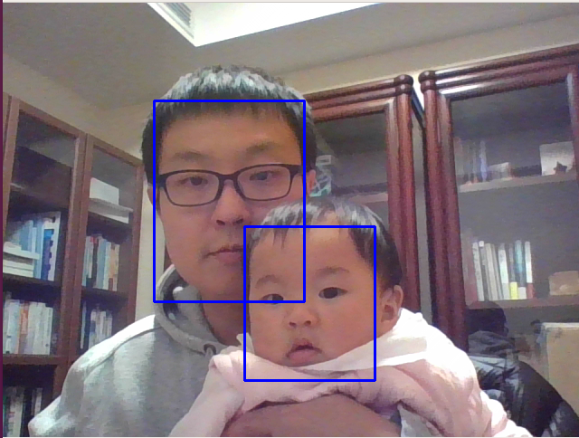

# MTCNN

`PyTorch` implementation of **inference stage** of face detection algorithm described in  
[Joint Face Detection and Alignment using Multi-task Cascaded Convolutional Networks](https://arxiv.org/abs/1604.02878).



## Why this projects
[mtcnn-pytorch](https://github.com/TropComplique/mtcnn-pytorch) This is the most popular pytorch implementation of mtcnn. There are some disadvantages I found when using it for real-time detection task.

* Mix torch operation and numpy operation together, which resulting in slow inference speed (Cannot run on GPU).
* Based on the old version of pytorch (0.2).

So I create this project and make some improvments:
* Transfer all numpy operation to torch operation, so that it can benefit from GPU acceleration.
* Automatic run on 'CPU' or 'GPU'.
* Based on the latest version of pytorch (1.3)
* Real-time face tracking

## Installation
1. Create virtual environment 
   ```
   # conda create -n face_detection
   ```
2. Activate virtual environment
   ```
   # source activate face_detection
   ```
3. [Install PyTorch](https://pytorch.org/)
   ```
   (face_detection)# conda install pytorch torchvision cudatoolkit=10.1 -c pytorch
   ```

4. Install Jupyter Notebook
   ```
   (face_detection)# conda install jupyter notebook
   ```

5. Install `opencv`
   ```
   (face_detection)# pip install opencv-python
   ```

## How to use it
Just download the repository and then do this
```
import sys
import os
sys.path.append(os.pardir)
from importlib import import_module
import cv2
from src.detect import FaceDetector

# import camera driver
if os.environ.get('CAMERA'):
    Camera = import_module('camera_' + os.environ['CAMERA']).Camera
else:
    from camera import Camera

if __name__ == "__main__":
    detector = FaceDetector()
    
    while True:
        frame = Camera().get_frame()
        image = cv2.cvtColor(frame, cv2.COLOR_BGR2RGB)        
        bounding_boxes = detector.detect(image)

        for i in range(len(bounding_boxes)):
            cv2.rectangle(frame, (int(bounding_boxes[i][0]), int(bounding_boxes[i][1])),
                         (int(bounding_boxes[i][2]), int(bounding_boxes[i][3])), (255, 0, 0), 2)

        cv2.imshow('capture', frame)
        key = cv2.waitKey(1)
        if key & 0xFF == ord('q'):
            break
```
or just run:
```
(face_detection)# cd MTCNN_face_detection_alignment_pytorch/src/
(face_detection)# CAMERA=opencv python test.py
```

## Tutorial
[Detect step by step](./notebooks/try_mtcnn_step_by_step.ipynb)

## Credit
This implementation is heavily inspired by:
* [TropComplique/mtcnn-pytorch](https://github.com/TropComplique/mtcnn-pytorch)
* [faciallab/FaceDetector](https://github.com/faciallab/FaceDetector)

## Citation
```
@article{7553523,
    author={K. Zhang and Z. Zhang and Z. Li and Y. Qiao}, 
    journal={IEEE Signal Processing Letters}, 
    title={Joint Face Detection and Alignment Using Multitask Cascaded Convolutional Networks}, 
    year={2016}, 
    volume={23}, 
    number={10}, 
    pages={1499-1503}, 
    keywords={Benchmark testing;Computer architecture;Convolution;Detectors;Face;Face detection;Training;Cascaded convolutional neural network (CNN);face alignment;face detection}, 
    doi={10.1109/LSP.2016.2603342}, 
    ISSN={1070-9908}, 
    month={Oct}
}
```